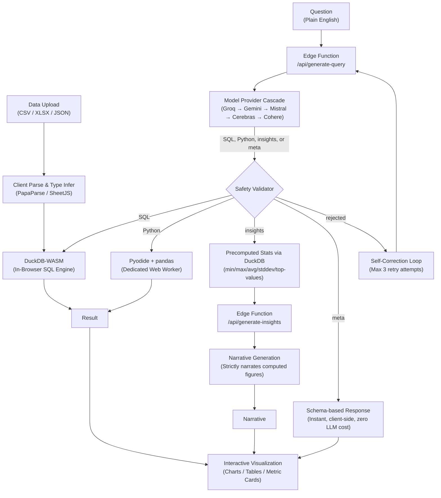

# AI Data Analyst Agent

[](https://github.com/HarshPatil0804/Data-Analyst-AI-Agent/actions/workflows/ci.yml)
[](https://vercel.com/new/clone?repository-url=https%3A%2F%2Fgithub.com%2FHarshPatil0804%2FData-Analyst-AI-Agent)


> 🚀 **Live Demo**: [https://data-analyst-ai-agent-nu.vercel.app](https://data-analyst-ai-agent-nu.vercel.app)

Upload a CSV, Excel (.xlsx), or JSON file, ask questions about it in plain English, and get a real, verified, executed answer back — not a guess.

**Data privacy, in one line:** your data never leaves your browser — DuckDB and Python both run client-side; the only thing sent to a server is the plain-text question itself, forwarded to whichever model provider generates query code (Groq, Gemini, Mistral, Cerebras, or Cohere), never your raw dataset.

## The Problem This Solves

Most "AI + your data" demos are LLM chat wrappers: the model reads a sample of your rows and generates plausible-sounding prose. It's confident, but frequently wrong — there's no code execution, no verification, and nothing stopping it from hallucinating figures that sound convincing.

This project takes a deterministic execution approach:
- For computable questions, the LLM writes **SQL or Python**. That code is **validated** against the real schema and an AST/heuristic safety layer, then **executed directly** against the data, displaying only verified results.
- If code is unsafe, hallucinates nonexistent columns, or errors during runtime, the system **retries with full error context fed back to the model** (up to 3 attempts).
- For open-ended questions (*"summarize this dataset"*, *"what stands out"*), an **insights engine** runs batched DuckDB queries for real summary metrics (min/max/avg/stddev and correlations), then has the model narrate *only* those real numbers.
- For structural inquiries (*"what columns do you have"*, *"what can I ask you"*), a **meta engine** answers instantly and for free from schema facts already known in the browser, requiring no LLM call.
- For unrelated questions, the agent declines honestly instead of fabricating responses.

Every answer displays a badge for the active engine and model provider, and toggling **Dev Mode** reveals the exact generated SQL/Python code.

## Architecture



Everything except the LLM call runs **entirely in the browser** — DuckDB-WASM for SQL queries, Pyodide (in a dedicated Web Worker) for statistical Python, and PapaParse/SheetJS for parsing files locally.

## Screenshots

| | |
|---|---|
|  Homepage |  SQL answer, chart + code shown |

## Key Technical Decisions

| Choice | Rationale |
|---|---|
| **DuckDB-WASM over backend DB** | Zero server costs, zero security surface on the server, instant analytics directly inside browser memory. |
| **Pyodide in a Web Worker** | Warmed up in the background so heavy statistical libraries (NumPy, pandas) load without freezing the UI thread. |
| **5-Provider Failover Chain** | Supports Groq, Gemini, Mistral, Cerebras, and Cohere. If one provider hits a rate limit, requests automatically cascade to the next available provider. |
| **Validation Layer** | Prevents prompt failures, schema hallucinations, and non-SELECT statements before code reaches the execution engines. |
| **Self-Correction Retry Loop** | Feeds runtime or validation errors directly back into the LLM context to automatically fix syntax and logic errors. |
| **Comprehensive Test Suite** | 200+ unit and integration tests covering parsing, safety validation, chart heuristics, failover logic, and retry cycles. |

## Feature Overview

- **Multi-Format Ingestion**: Upload CSV, Excel (`.xlsx`, `.xls`), and JSON files, or use the pre-packaged 1,440-row demo dataset.
- **Smart Routing**: Routes plain-English questions to DuckDB SQL, Python/pandas, statistical narrative insights, or instant meta-analysis.
- **Interactive Visualizations**: Automatic selection of pie, bar, line, and KPI metrics powered by ECharts and Recharts, with full table views always available.
- **Natural Language Chart Adjustments**: Prompt adjustments like *"change to bar chart"* or *"sort descending"* update visualizations immediately client-side.
- **Multi-Turn Memory**: Follow up seamlessly on previous queries (e.g., *"now group that by country"*).
- **Session Cache**: Immediate responses for repeated or sample questions without unnecessary API consumption.
- **Dev Mode & Code Inspection**: Inspect and copy the exact generated SQL or Python code behind every answer.
- **Export Capabilities**: Export rendered charts as PNG images or generate comprehensive Markdown conversation summaries.
- **Optional Google Authentication & History**: Persist conversations securely with Supabase OAuth and Row-Level Security (RLS).
- **API Rate Limiting**: Built-in edge protection with Upstash Redis.

## Getting Started

### Prerequisites

- Node.js 18+
- [Vercel CLI](https://vercel.com/docs/cli) (recommended for running local API routes)
- At least one free LLM API key (e.g., [Groq](https://console.groq.com), [Google Gemini](https://aistudio.google.com/apikey), [Mistral](https://console.mistral.ai), [Cerebras](https://cloud.cerebras.ai), or [Cohere](https://dashboard.cohere.com))

### Installation & Local Setup

1. **Clone the repository:**
   ```bash
   git clone https://github.com/HarshPatil0804/Data-Analyst-AI-Agent.git
   cd Data-Analyst-AI-Agent
   ```

2. **Install dependencies:**
   ```bash
   npm install
   ```

3. **Configure environment variables:**
   ```bash
   cp .env.local.example .env.local
   ```
   Add your API key (e.g. `GROQ_API_KEY=...`) to `.env.local`.

4. **Run the development server:**
   ```bash
   vercel dev
   ```
   *(Or run `npm run dev` to preview the frontend only).*

## Running Tests

```bash
npm test          # Run test suite once
npm run test:watch # Run in watch mode
```

Runs comprehensive tests covering file parsers, SQL/Python validators, chart detectors, failover chains, and execution retries.

## Deployment

1. Push your repository to GitHub.
2. Import the project into [Vercel](https://vercel.com).
3. Set your environment variables (`GROQ_API_KEY`, etc.) in **Project Settings → Environment Variables**.
4. Deploy!
