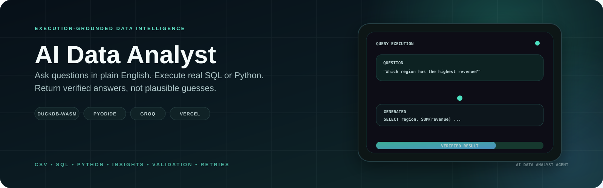
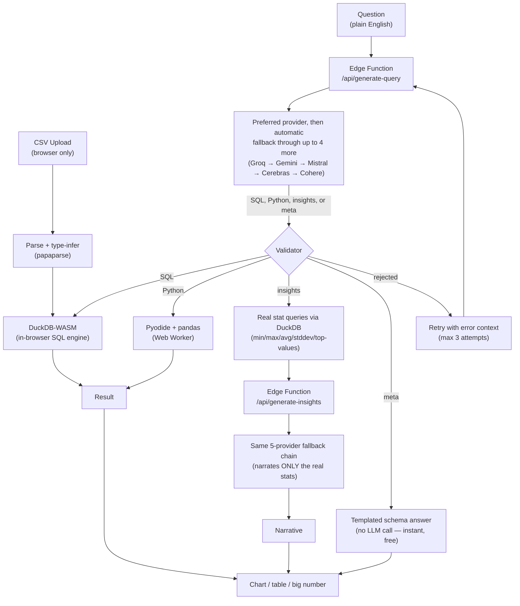

<p align="center">
  
</p>

# AI Data Analyst Agent

[](https://github.com/Zephyrex21/ai-data-analyst-agent/actions/workflows/ci.yml)


[](./LICENSE)

> **Ask questions about a CSV in plain English and get answers grounded in executed data—not guesses.**

**[Try the live app →](https://ai-data-analyst-agent-one.vercel.app/)**

## Overview

AI Data Analyst Agent turns natural-language questions into **validated, executable SQL or Python**, runs that code against the user's actual dataset in the browser, and presents the real result as a chart, table, or metric.

The core principle is simple:

**LLM generates → validator checks → runtime executes → real result is returned.**

For open-ended questions, an insights engine computes real statistics before the LLM narrates them. Structural questions use a local meta engine without an LLM call. Off-topic questions are explicitly declined rather than answered as if the system were a general chatbot.

### Privacy-first execution

CSV data never leaves the browser. DuckDB-WASM handles SQL execution and Pyodide runs Python/pandas inside a Web Worker. Only the user's plain-text question is sent to the selected model provider through a small serverless proxy; provider API keys never reach the client.

## Architecture



Everything except the LLM calls runs **entirely in the browser**. The system uses DuckDB-WASM for SQL and statistical queries, and Pyodide in a Web Worker for Python execution.

## Core Engineering

| Capability | Implementation |
| --- | --- |
| Natural language analysis | LLM-generated SQL, Python, insights, or meta responses |
| SQL execution | DuckDB-WASM in the browser |
| Python execution | Pyodide + pandas in a Web Worker |
| Code safety | SQL/Python validation before execution |
| Self-correction | Up to 3 retries with validation/execution errors fed back to the model |
| Model resilience | Groq → Gemini → Mistral → Cerebras → Cohere fallback chain |
| Insights | Real DuckDB statistics narrated by the model |
| Visualization | Automatic chart selection + tables + big-number results |
| Conversation | Multi-turn context and session caching |
| Privacy | Dataset stays client-side |

## Why It Is Different

Most “chat with your data” applications allow an LLM to reason directly over sampled rows. This project instead makes **execution the source of truth**.

- The model does not directly invent numeric answers.
- Generated SQL/Python is validated before execution.
- Hallucinated columns and unsafe operations are rejected.
- Failed execution is returned to the model for correction.
- Insights are computed from real statistics before narration.
- Meta questions are answered locally without an LLM call.
- Off-topic questions receive an explicit decline.

## Features

- Drag-and-drop CSV upload with client-side type inference
- Bundled sample dataset for zero-setup demonstrations
- Natural language → SQL, Python, insights, or meta responses
- Multi-turn follow-up questions
- Automatic SQL/Python validation and self-correction
- Automatic model-provider failover
- Schema-aware follow-up suggestions
- Natural-language chart adjustments
- Dev Mode with generated SQL/Python
- Charts, tables and big-number results
- PNG chart export and Markdown conversation export
- Session caching for repeated questions
- Proactive dataset summary and data-quality signals

## Tech Stack

| Layer | Technologies |
| --- | --- |
| Frontend | React, TypeScript, Vite, Tailwind CSS |
| Data | DuckDB-WASM, PapaParse |
| Python runtime | Pyodide, pandas, Web Workers |
| AI | Groq, Gemini, Mistral, Cerebras, Cohere |
| Backend | Vercel Serverless Functions |
| Testing | Vitest |
| Deployment | Vercel |

## Local Development

The application uses a Vercel serverless function for model calls, so use the Vercel CLI for local development.

```bash
npm install -g vercel
npm install
cp .env.local.example .env.local
vercel dev
```

Set `GROQ_API_KEY` as the required provider key. Gemini, Mistral, Cerebras and Cohere keys are optional; configured providers participate in the automatic fallback chain.

## Testing

```bash
npm test
npm run test:watch
```

The project currently contains **208 automated tests** covering CSV edge cases, validators, chart selection, conversation handling, provider failover, response parsing, retry orchestration and other core behavior. CI runs the test suite and production build on pushes and pull requests to `main`.

A separate evaluation suite can be run with:

```bash
npm run eval
```

The evaluation suite uses real LLM calls against a fixed question set and is intentionally kept outside CI.

## Security & Privacy

- CSV files remain client-side.
- API keys are kept behind serverless functions.
- Only the user's question is sent to an LLM provider.
- SQL is restricted to safe read operations.
- Unknown tables and columns are rejected.
- Unsafe Python patterns are blocked.
- Result sizes are capped.
- Failed generations are retried with execution context rather than blindly displayed.

## Limitations

- Single flat-table datasets only
- No joins or multi-file analysis
- Multi-statement CTEs are not supported
- Validators are heuristic rather than full SQL/Python parsers
- No authentication or persistent server-side sessions by design

## Documentation

- [`ENGINEERING_JOURNAL.md`](./ENGINEERING_JOURNAL.md) — engineering decisions, bugs and fixes
- [`demo-script.md`](./demo-script.md) — demo video shot list
- [`eval-set.md`](./eval-set.md) — LLM regression evaluation set

## License

[MIT](./LICENSE)

---

<p align="center">
  Built around one principle: <strong>execute the data, then trust the result.</strong>
</p>
